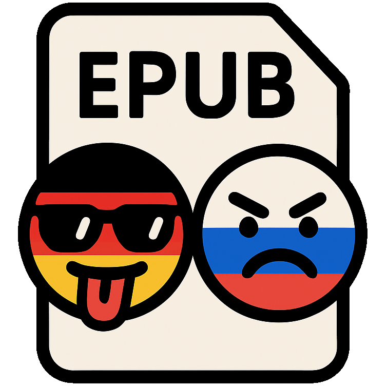

# 🇩🇪→🇷🇺 German to Bilingual German-Russian EPUB Translator

This tool is designed for learners and language enthusiasts who want to transform German-language EPUBs into bilingual format. Each sentence is followed by a partial translation with key words and phrases explained in Russian. This method helps build understanding naturally and expand vocabulary through context.

By default: **German in → German-Russian EPUB out**  
Other language pairs can also be used via parameters.

---

## 📘 `book_nllb.py` — Main Translator Script



This script converts German EPUBs into bilingual German-Russian EPUBs using:

- **Meta’s NLLB** for machine translation  
- **KeyBERT** for keyword extraction  
- Inline translations for improved contextual learning

> 💡 Recommended: Use **VS Code** with a **devcontainer** for a consistent environment.  
> Or, if you prefer the usual workflow:

```bash
uv venv
.venv\Scripts\activate  # On Windows
uv pip install .
python book_nllb.py input.epub output.epub
```


---

## 🗃️ `convert_sqlite.py` — Vocabulary Support Script

Loads German nouns from a JSON file into an SQLite database.  
This can be helpful when working with `book_nllb.py` for word lookups and review.

Reference file:  
[german_nouns_output.json](https://github.com/Hanttone/der-die-das-game/blob/master/data/german_nouns_output.json)


---

## 🤖 `book_gemma.py` — Experimental Translation Script

An alternative translation approach using **Gemma 3** via **Ollama**.

- Outputs bilingual German-Russian translation in JSON format
- Generates word frequency statistics
- Allows filtering and selective translation
- Intended for testing, not optimized for production use

> ⚠️ This is demo code with no setup or containerization. Useful for experiments or curiosity.

---

Pull requests are welcome. Suggestions appreciated. And yes, there might be a bug or two — feel free to point them out.

